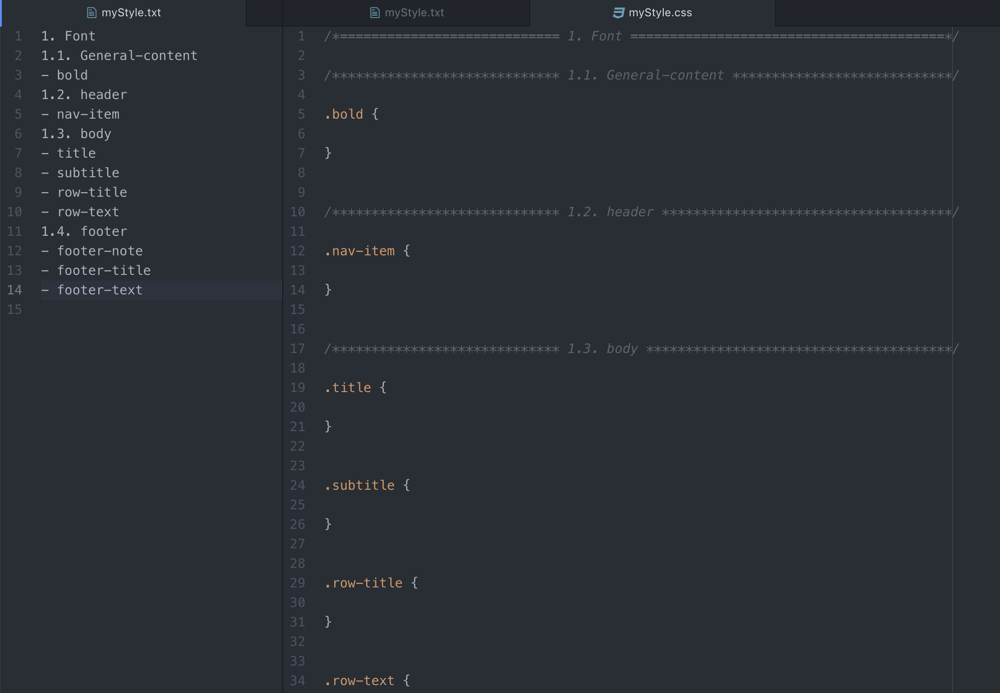

# fromTXTtoCSS
This script allows to transform a ordinated **index into CSS** ordered in the same way. 

Each section in the index is seperated by a commented line. 
The _title_ uses '=' to highlight and the _subtitle_ uses '*'

## Version 1.0

## Next Step
- [ ] sort the css file based on index (adding the absent class and putting the class that isn't in the index at the end of the css file)
